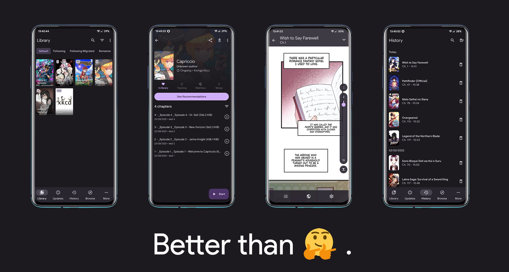

| Release Builds | Tachiyomi Support Server |
|----------|----------|
|  |  |

# Takoyomi
Tachiyomi is a free and open source manga reader for Android 6.0 and above. Takoyomi is a fork of TachiyomiSY which aims to implement UI changes which TachiyomiSY did or have not.

## Download
Get the app from the [releases page](https://github.com/crepetf/takoyomi/releases/latest).

## Issues, Feature Requests and Contributing

Please make sure to read the full guidelines. Your issue may be closed without warning if you do not.

Contributing

See [CONTRIBUTING.md](./CONTRIBUTING.md).

Code of Conduct

See [CODE_OF_CONDUCT.md](./CODE_OF_CONDUCT.md).

## FAQ

[See our website.](https://tachiyomi.org/)
You can also reach out to us on [Discord](https://discord.gg/tachiyomi).
